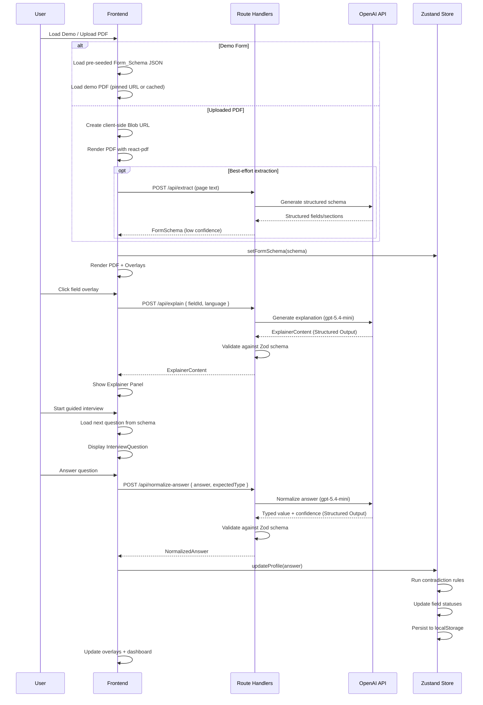
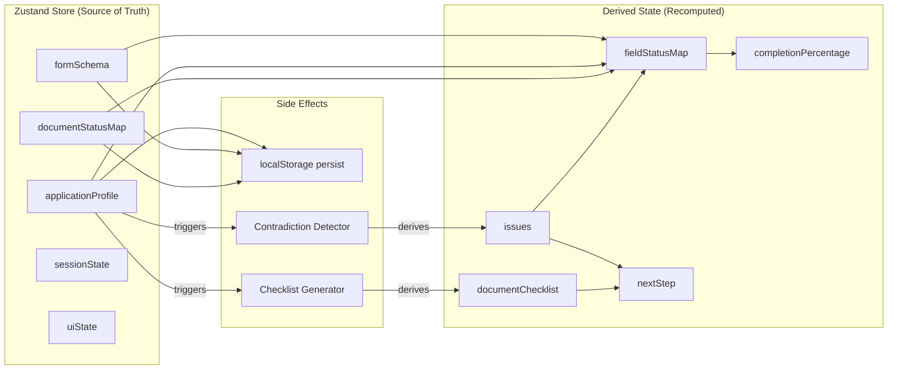
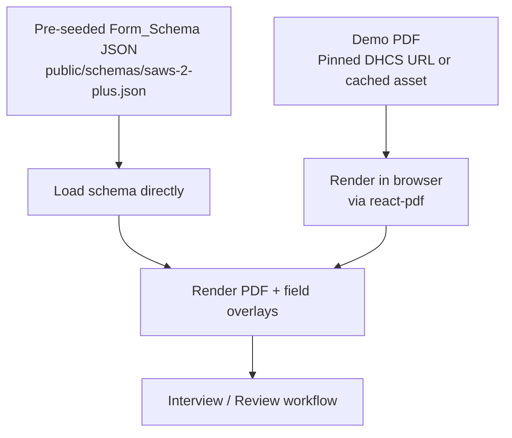

# Design Document: FormFlow MVP

## Overview

FormFlow is an AI-powered web application that transforms complex government PDF forms into interactive, guided completion workflows. The MVP targets the California SAWS 2 PLUS form (CalFresh/Medi-Cal) and serves elderly immigrants, non-native English speakers, and low-digital-literacy users.

Pinned demo form source: https://www.dhcs.ca.gov/formsandpubs/laws/Documents/SPA%2013-022%20Attachment%202%20SAWS%202%20PLUS_FINAL%207%2024%2013%20ADA.pdf

The system follows a pipeline architecture: a user loads the demo form (or uploads a PDF), the pre-seeded schema (or best-effort extraction) provides structured field data, the frontend renders the PDF with interactive overlays via react-pdf, and a schema-driven interview engine guides the user through completion while tracking state, detecting contradictions, and generating document checklists. The interview flow is deterministic — driven by the Form_Schema, not the LLM. AI is used for explanation, translation, and answer normalization.

### Key Design Decisions

| Decision | Choice | Rationale |
|---|---|---|
| Framework | Next.js 14+ (App Router) | Full-stack React with Route Handlers (`app/api/*/route.ts`), SSR for landing page SEO, fast iteration |
| Styling | Tailwind CSS + shadcn/ui | Accessible component primitives, consistent design, rapid prototyping. Components are scaffolded via the **shadcn MCP** and installed into `components/ui/`. Style preset `b3963UvzV` (luma/zinc/indigo) applied at init via `npx shadcn@latest apply b3963UvzV`. |
| PDF Rendering | react-pdf (PDF.js wrapper) | React-native integration, page-level rendering, text layer access |
| State Management | Zustand with persist middleware | Lightweight, localStorage persistence built-in, no boilerplate |
| AI Provider | OpenAI API (gpt-5.4-mini / gpt-5.5 stretch) | gpt-5.4-mini as default for explainer content, interview phrasing, answer normalization, and Spanish translation. gpt-5.5 only for one-shot complex document reasoning (stretch). gpt-5.4-nano as budget option if latency/cost matter and quality is acceptable. Structured Outputs enforced for all state-impacting responses. |
| Extraction Strategy | Pre-seeded schema (demo), best-effort fallback (upload) | Demo path uses a curated pre-seeded Form_Schema — no live extraction needed. Upload path renders the PDF client-side and may attempt best-effort extraction with low-confidence overlays. Vision analysis remains in the architecture as a stretch capability but is not required for the demo. |
| Persistence | localStorage (no auth) | Zero-friction for target users, hackathon-appropriate |
| Language | TypeScript throughout | Type safety for complex data models, better DX |

## Architecture

### High-Level Architecture

```mermaid
graph TB
    subgraph "Browser (Client)"
        LP[Landing Page]
        UP[Upload / Processing]
        VFM[Visual Form Map]
        EP[Explainer Panel]
        IE[Interview Engine UI]
        DC[Document Checklist UI]
        RD[Review Dashboard]
        ZS[Zustand Store<br/>+ localStorage]
    end

    subgraph "Next.js Server (Route Handlers)"
        EXTRACT[/api/extract<br/>fallback only]
        EXPLAIN[/api/explain]
        NORMALIZE[/api/normalize-answer]
        TRANSLATE[/api/translate]
    end

    subgraph "External Services"
        OPENAI[OpenAI API<br/>gpt-5.4-mini]
        VISION[OpenAI Vision API<br/>gpt-5.5 stretch]
    end

    subgraph "Static Assets"
        DEMO[Pre-seeded Demo<br/>Form Schema JSON]
        DEMO_PDF[SAWS 2 PLUS Demo PDF<br/>Pinned DHCS URL or cached asset]
        PDF_FILE[Uploaded PDF<br/>Client-side Blob URL]
    end

    LP --> UP
    UP -->|Try demo form| DEMO_PDF
    UP -->|Try demo form| DEMO
    UP -->|Upload PDF| PDF_FILE
    UP -->|fallback trigger| EXTRACT
    EXTRACT -->|best-effort extraction| OPENAI
    VFM --> EP
    EP -->|field context| EXPLAIN
    EXPLAIN --> OPENAI
    IE -->|answer normalization| NORMALIZE
    NORMALIZE --> OPENAI
    EP --> TRANSLATE
    IE --> TRANSLATE
    TRANSLATE --> OPENAI
    VFM --- ZS
    IE --- ZS
    DC --- ZS
    RD --- ZS
```

### Data Flow Pipeline



### Application State Architecture

The source of truth is the schema, application profile, and document status map. Everything else (field statuses, issues, completion percentage, suggested next step) is derived or recomputed — not stored.



## Components and Interfaces

### Page Components

#### `LandingPage` (`/`)
- Renders hero section with headline, subtext, and privacy note
- Two CTAs: "Upload a PDF" and "Try demo form"
- Large text, high contrast, minimal clutter
- On "Try demo form" click: loads pre-seeded schema and navigates to `/form`

#### `FormWorkspace` (`/form`)
- Main workspace layout: PDF viewer (left) + side panel (right)
- Top: progress bar, language toggle, navigation breadcrumbs
- Bottom: issue count badge
- Manages panel state: explainer, interview, checklist, or review
- Responsive: stacks vertically on mobile

#### `ReviewPage` (`/form/review`)
- Full-screen review dashboard
- Completion percentage, section summaries, issue list, document checklist
- Click-through navigation back to specific fields

### Core UI Components

> shadcn/ui primitives (Button, Card, Badge, Dialog, etc.) are the foundation for all components below. Add new primitives using the **shadcn MCP** — never copy component source manually. Installed primitives live in `components/ui/`.

| Component | Props | Responsibility |
|---|---|---|
| `PdfViewer` | `fileUrl, currentPage, onPageChange` | Renders PDF pages via react-pdf, exposes page dimensions |
| `FieldOverlay` | `field: FormField, status: FieldStatus, onClick` | Renders a single colored bounding box with label |
| `OverlayLayer` | `fields: FormField[], statusMap, onFieldClick` | Positions all FieldOverlay components over the PDF |
| `ProgressBar` | `completed, total` | Shows completion percentage with accessible label |
| `ExplainerPanel` | `field: FormField, content: ExplainerContent, language` | Displays explanation with action buttons |
| `InterviewCard` | `question: InterviewQuestion, onAnswer, onSkip, onBack` | Single-question interview UI with input and action buttons |
| `DocumentCard` | `doc: DocumentRequirement, onMarkPresent` | Single document requirement with status and examples |
| `IssueCard` | `issue: Issue, onNavigate` | Displays contradiction/issue with link to related field |
| `LanguageToggle` | `currentLang, onToggle` | Switches between English and Spanish |
| `ProcessingSteps` | `currentStep, steps` | Animated step-by-step progress during extraction |
| `FileUpload` | `onFileSelect, maxSize, accept` | Drag-and-drop or click file upload with validation |

### Route Handler Interfaces

> All Route Handlers live under `app/api/*/route.ts` following the Next.js App Router convention.
> AI responses that feed application state SHALL use OpenAI Structured Outputs with strict schemas and server-side Zod validation before updating Zustand state. This applies to ExplainerContent, InterviewQuestion phrasing, ExtractResponse, and answer normalization results.

#### `POST /api/explain`
```typescript
// Request:
interface ExplainRequest {
  fieldId: string;
  sectionContext: string;
  language: 'en' | 'es';
}
// Response (Structured Output, validated with Zod):
interface ExplainerContent {
  meaning: string;
  whyAsked: string;
  exampleAnswer: string;
  documentsNeeded: string;
  commonMistake?: string;
}
```

#### `POST /api/normalize-answer`
```typescript
// Request:
interface NormalizeAnswerRequest {
  answer: string;
  expectedType: 'text' | 'number' | 'currency' | 'date' | 'yes_no' | 'select';
  fieldContext: string;
  language: 'en' | 'es';
}
// Response (Structured Output, validated with Zod):
interface NormalizeAnswerResponse {
  typedValue: string | number | boolean | null;
  status: FieldStatus;
  confidence: number; // 0.0 - 1.0
  needsClarification: boolean;
  clarificationPrompt?: string;
}
```

#### `POST /api/translate`
```typescript
// Request:
interface TranslateRequest {
  texts: string[];
  targetLanguage: 'es';
  context: 'form_explanation' | 'interview_question' | 'ui_label';
}
// Response:
interface TranslateResponse {
  translations: string[];
}
```

#### `POST /api/extract` (fallback only — pre-seeded schema bypasses this)
```typescript
// Request:
interface ExtractRequest {
  pageTexts: string[];       // text extracted client-side via PDF.js
  pageCount: number;
}
// Response (Structured Output, validated with Zod):
interface ExtractResponse {
  schema: FormSchema;
  confidence: 'high' | 'medium' | 'low';
  extractionMethod: 'preseeded' | 'best_effort';
  warnings?: string[];
}
```

### Zustand Store Interface

The store holds only source-of-truth data. Field statuses, issues, completion percentage, and suggested next steps are derived/recomputed — not stored.

```typescript
interface FormFlowStore {
  // Form Schema (source of truth)
  formSchema: FormSchema | null;
  setFormSchema: (schema: FormSchema) => void;

  // Application Profile (source of truth)
  applicationProfile: Record<string, ProfileEntry>;
  updateProfileEntry: (key: string, entry: Partial<ProfileEntry>) => void;
  removeProfileEntry: (key: string) => void;

  // Document Status Map (source of truth)
  documentStatusMap: Record<string, 'needed' | 'present'>;
  markDocumentPresent: (docId: string) => void;
  markDocumentNeeded: (docId: string) => void;

  // Derived State (recomputed, not persisted)
  getFieldStatusMap: () => Record<string, FieldStatus>;
  getFieldStatus: (fieldId: string) => FieldStatus;
  getIssues: () => Issue[];
  getDocumentChecklist: () => DocumentRequirement[];
  getCompletionPercentage: () => number;
  getSuggestedNextStep: () => string;

  // Session
  sessionId: string;
  language: 'en' | 'es';
  setLanguage: (lang: 'en' | 'es') => void;
  currentPage: number;
  setCurrentPage: (page: number) => void;
  activePanelView: 'explainer' | 'interview' | 'checklist' | 'review' | null;
  setActivePanelView: (view: FormFlowStore['activePanelView']) => void;

  // Actions
  runContradictionDetection: () => Issue[];
  regenerateDocumentChecklist: () => DocumentRequirement[];
  resetSession: () => void;
}
```

### Contradiction Detection Engine

The Contradiction Detector runs client-side as a pure function within the Zustand store. It evaluates a fixed set of deterministic rules against the current Application Profile state.

```typescript
interface ContradictionRule {
  id: string;
  name: string;
  evaluate: (profile: Record<string, ProfileEntry>, schema: FormSchema) => Issue | null;
}

// Five demo rules:
const CONTRADICTION_RULES: ContradictionRule[] = [
  employmentVsIncomeRule,      // Rule 1: unemployed + income > 0
  householdSizeVsMembersRule,  // Rule 2: size ≠ member count
  addressProofMissingRule,     // Rule 3: address filled, no proof
  incomeProofMissingRule,      // Rule 4: income filled, no proof
  signatureMissingRule,        // Rule 5: signature field incomplete
];

function runContradictionDetection(
  profile: Record<string, ProfileEntry>,
  schema: FormSchema,
  documentChecklist: DocumentRequirement[]
): Issue[] {
  return CONTRADICTION_RULES
    .map(rule => rule.evaluate(profile, schema))
    .filter((issue): issue is Issue => issue !== null);
}
```

### AI Integration Layer

All AI calls go through a shared utility that handles:
- API key management (server-side only via environment variable)
- Rate limiting and retry logic
- Response validation via OpenAI Structured Outputs with strict schemas
- Server-side Zod validation before any AI response updates Zustand state
- Guardrail enforcement (no eligibility guarantees, no legal advice)
- Language context injection

```typescript
// Shared AI client configuration
interface AIClientConfig {
  model: 'gpt-5.4-mini' | 'gpt-5.5' | 'gpt-5.4-nano';
  temperature: number;
  maxTokens: number;
  systemPrompt: string;
  responseFormat?: object; // OpenAI Structured Output schema
}

// Model selection guidance:
// - gpt-5.4-mini (default): explainer content, interview phrasing, answer normalization, Spanish translation
// - gpt-5.5 (stretch only): one-shot complex document reasoning (e.g., vision-based extraction of unknown PDFs)
// - gpt-5.4-nano (budget option): only if latency/cost matter and quality is acceptable

// System prompts enforce guardrails:
const SYSTEM_PROMPTS = {
  explainer: `You are a plain-language form assistant. Explain government form fields 
    simply. Never guarantee eligibility. Never give legal advice. Use hedging language 
    like "This may apply to you" and "You should double-check this."...`,
  answerNormalizer: `You are a form answer normalizer. Given a user's free-text answer 
    and the expected field type, extract the typed value, assess confidence, and flag 
    if clarification is needed. Return structured JSON matching the provided schema.`,
  translator: `You are a professional translator specializing in government benefits 
    terminology. Translate to natural, accessible Spanish...`,
  visionAnalyzer: `You are a document layout analyst. Analyze this government form page 
    image and identify: section boundaries with headers, input fields (text boxes, 
    checkboxes, radio buttons, signature lines) with bounding box coordinates as 
    percentages of page dimensions, table structures with row/column layouts, field 
    groupings (which fields belong together visually), and any pre-filled values visible 
    in the form. Return structured JSON matching the provided schema.`,
};
```

### Extraction Pipeline

The extraction pipeline follows two distinct paths. The demo path is the primary success path for the hackathon; the upload path is a graceful fallback.

#### Primary Demo Path (Required)



The demo form always uses the pre-seeded schema. No extraction, no AI calls, no server-side PDF storage. The PDF is kept in the browser and rendered with react-pdf. The schema is loaded from a static JSON file.

#### Fallback Upload Path (Best-Effort)

```mermaid
graph TD
    UPLOAD_PDF[Uploaded PDF] --> CLIENT_RENDER[Render in browser<br/>via react-pdf]
    CLIENT_RENDER --> TEXT[PDF.js text extraction<br/>client-side]
    TEXT --> EXTRACT_API[POST /api/extract<br/>best-effort schema generation]
    EXTRACT_API --> AI[gpt-5.4-mini:<br/>structured schema from text]
    AI --> SCHEMA[FormSchema<br/>confidence: low/medium]
    SCHEMA --> CHECK{Confidence acceptable?}
    CHECK -->|Yes| OVERLAYS[Low-confidence overlays<br/>+ interview workflow]
    CHECK -->|No| PROMPT[Prompt user:<br/>"Try the demo form instead"]
```

For uploaded PDFs, the file stays in the browser as a Blob URL. Text is extracted client-side via PDF.js and sent to `/api/extract` for best-effort schema generation. If confidence is low, the user is prompted to try the demo form instead.

#### Vision Analysis (Stretch Capability)

Vision analysis via OpenAI's vision API remains in the architecture as a future capability for analyzing page images to understand visual layout, spatial relationships, table structures, and checkbox groupings. It is **not required for the demo path** and should only be attempted if the core demo workflow is complete and stable. If implemented, it would use `gpt-5.5` for one-shot complex document reasoning.

### Pre-seeded Demo Form Schema

For the demo form, the pre-seeded schema includes:
- All sections with titles, page ranges, and bounding boxes
- All fields with labels, types, bounding boxes, and requirements
- Pre-generated plain-language labels and explanations
- Document requirement mappings
- The pinned source PDF URL: `https://www.dhcs.ca.gov/formsandpubs/laws/Documents/SPA%2013-022%20Attachment%202%20SAWS%202%20PLUS_FINAL%207%2024%2013%20ADA.pdf`

This ensures demo reliability while the best-effort extraction fallback handles arbitrary uploaded PDFs.

## Data Models

### Core Types

```typescript
// ---- Form Schema Types ----

interface FormSchema {
  id: string;
  title: string;
  plainTitle: string;
  pageCount: number;
  sourceFileUrl: string;
  sections: FormSection[];
  fields: FormField[];
  documentRequirements: DocumentRequirement[];
  metadata: {
    extractionMethod: 'preseeded' | 'best_effort';
    confidence: 'high' | 'medium' | 'low';
    extractedAt: string; // ISO 8601
  };
}

interface FormSection {
  id: string;
  title: string;
  plainTitle: string;
  pageStart: number;
  pageEnd: number;
  bbox: BoundingBox;
  summary: string;
  fieldIds: string[];
}

interface FormField {
  id: string;
  sectionId: string;
  questionId: string;       // maps to interview question sequence
  profileKey: string;       // key in ApplicationProfile for this field's answer
  label: string;
  plainLabel: string;
  page: number;
  bbox: BoundingBox;
  fieldType: 'text' | 'number' | 'currency' | 'date' | 'checkbox' | 'select' | 'signature';
  required: boolean;
  requiredForDemo: boolean; // true if this field counts toward demo completion percentage
  status: FieldStatus;
  statusReason: string | null; // user-facing explanation, e.g., "Needs proof of income"
  value: string | number | boolean | null;
  source: AnswerSource | null;
  confidence: number | null;
  evidenceRequired: string[]; // DocumentRequirement IDs
  translations?: {
    es?: {
      plainLabel: string;
      statusReason?: string;
    };
  };
}

type FieldStatus = 'missing' | 'complete' | 'needs_confirmation' | 'inferred' | 'conflicting';

type AnswerSource = 'user_chat' | 'extracted_document' | 'manual_edit' | 'inferred' | 'pre_seeded';

interface BoundingBox {
  x: number;      // left edge, percentage of page width (0-100)
  y: number;      // top edge, percentage of page height (0-100)
  width: number;  // percentage of page width
  height: number; // percentage of page height
}

// ---- Application Profile Types ----

interface ProfileEntry {
  value: string | number | boolean | null;
  source: AnswerSource; // 'user_chat' | 'extracted_document' | 'manual_edit' | 'inferred' | 'pre_seeded'
  confidence: number; // 0.0 - 1.0
  mappedFieldIds: string[];
  evidenceRequired: string[];
  status: FieldStatus;
  updatedAt: string; // ISO 8601
}

// ---- Issue Types ----

interface Issue {
  id: string;
  type: 'contradiction' | 'missing_evidence' | 'missing_required';
  severity: 'low' | 'medium' | 'high';
  message: string;
  plainMessage: string; // user-facing, plain language
  relatedFieldIds: string[];
  suggestedQuestion: string;
  ruleId: string;
  createdAt: string; // ISO 8601
}

// ---- Document Requirement Types ----

interface DocumentRequirement {
  id: string;
  title: string;
  plainExplanation: string;
  examples: string[];
  status: 'needed' | 'present'; // 'present' means user confirmed they have the document (not a file upload)
  relatedFieldIds: string[];
}

// ---- Interview Types ----

interface InterviewQuestion {
  id: string;
  text: string;
  whyAsking: string;
  expectedType: 'text' | 'number' | 'currency' | 'date' | 'yes_no' | 'select';
  options?: string[];
  mappedFieldIds: string[];
  translations?: {
    es?: {
      text: string;
      whyAsking: string;
      options?: string[];
    };
  };
}

interface InterviewSession {
  sectionId: string;
  questions: InterviewQuestion[];
  currentIndex: number;
  answers: { questionId: string; answer: string; skipped: boolean }[];
}

// ---- Explainer Types ----

interface ExplainerContent {
  meaning: string;
  whyAsked: string;
  exampleAnswer: string;
  documentsNeeded: string;
  commonMistake?: string;
  translations?: {
    es?: {
      meaning: string;
      whyAsked: string;
      exampleAnswer: string;
      documentsNeeded: string;
      commonMistake?: string;
    };
  };
}

// ---- Session Types ----

// Only source-of-truth data is persisted. Issues, document checklist,
// completion %, and next step are derived/recomputed on load.
interface SessionState {
  sessionId: string;
  formSchema: FormSchema | null;
  applicationProfile: Record<string, ProfileEntry>;
  documentStatusMap: Record<string, 'needed' | 'present'>; // source of truth for document statuses
  language: 'en' | 'es';
  currentPage: number;
  activePanelView: 'explainer' | 'interview' | 'checklist' | 'review' | null;
  createdAt: string;
  updatedAt: string;
}
```

### localStorage Schema

The Zustand persist middleware serializes the `SessionState` to localStorage under the key `formflow-session`. The schema version is tracked for migration support:

```typescript
interface PersistedState {
  version: number; // schema version for migrations
  state: SessionState;
}
```

### Pre-seeded Demo Form Schema Structure

The demo form schema is stored as a static JSON file at `public/schemas/saws-2-plus.json`. The demo PDF should be loaded from the pinned DHCS source URL, or from a cached local copy of that exact PDF if the hackathon environment needs offline reliability. The schema contains the full `FormSchema` object with pre-populated sections, fields, bounding boxes, and document requirements for the curated subset of the SAWS 2 PLUS form:

- **Applicant Information** section (name, DOB, SSN, address, phone)
- **Household Information** section (members, relationships, ages)
- **Income** section (employment status, wages, benefits, other income)
- **Expenses** section (rent, utilities, medical, childcare)
- **Signature / Certification** section (signature, date, attestation)

Each field includes pre-computed bounding boxes (as page-percentage coordinates) and pre-written plain-language labels and explanations, ensuring the demo works reliably without depending on AI extraction.


## Correctness Properties

*A property is a characteristic or behavior that should hold true across all valid executions of a system — essentially, a formal statement about what the system should do. Properties serve as the bridge between human-readable specifications and machine-verifiable correctness guarantees.*

The following properties were derived from the acceptance criteria across all 17 requirements. Each property is universally quantified and suitable for property-based testing with a library like `fast-check`.

### Property 1: Schema Structural Integrity — Field-Section Association

*For any* valid `FormSchema`, every `FormField`'s `sectionId` must reference an existing `FormSection.id` within the same schema.

**Validates: Requirements 3.3**

### Property 2: Fresh Schema Initialization

*For any* `FormSchema` produced by the extraction pipeline (whether pre-seeded or best-effort extracted), every `FormField` must have its `status` initialized to `"missing"`.

**Validates: Requirements 3.6**

### Property 3: Field Status to Color Mapping

*For any* valid `FieldStatus` value (`missing`, `complete`, `needs_confirmation`, `inferred`, `conflicting`), the status-to-color mapping function must return the correct corresponding color (`yellow`, `green`, `orange`, `blue`, `red` respectively), and the mapping must be total (no status value produces an undefined color).

**Validates: Requirements 4.2**

### Property 4: Completion Percentage Calculation

*For any* set of `FormField` objects with varying `required` flags and `FieldStatus` values, the completion percentage must equal the count of required fields with status `"complete"` divided by the total count of required fields. When there are zero required fields, the percentage must be 100.

**Validates: Requirements 4.5, 10.1**

### Property 5: ExplainerContent Structure Completeness

*For any* `ExplainerContent` object returned by the explain API, the `meaning`, `whyAsked`, `exampleAnswer`, and `documentsNeeded` properties must all be present and be non-empty strings.

**Validates: Requirements 5.2**

### Property 6: Answer-to-Profile Mapping with One-to-Many Support

*For any* valid interview answer mapped to N field IDs (where N ≥ 1), after the answer is recorded in the `ApplicationProfile`, all N mapped fields must have their `FieldStatus` updated from `"missing"` to a non-missing status, and the profile entry must contain all N field IDs in its `mappedFieldIds` array.

**Validates: Requirements 6.3, 7.4**

### Property 7: Skip Sets Needs Confirmation

*For any* interview question with one or more mapped field IDs, when the user clicks "I'm not sure," all mapped fields must have their `FieldStatus` set to `"needs_confirmation"` and the profile entry's source must not be `"user_chat"`.

**Validates: Requirements 6.4**

### Property 8: Answer Revision Recalculates Affected Statuses

*For any* existing profile entry that is revised with a new value, the profile entry must reflect the new value, and the `FieldStatus` of all mapped fields must be recalculated based on the updated profile state (including re-running contradiction detection on affected fields).

**Validates: Requirements 6.7**

### Property 9: ProfileEntry Structural Completeness

*For any* `ProfileEntry` stored in the `ApplicationProfile`, the entry must contain a `value`, a valid `source` (one of `user_chat`, `extracted_document`, `manual_edit`, `inferred`, `pre_seeded`), a `confidence` score between 0.0 and 1.0 inclusive, a non-empty `mappedFieldIds` array, and a valid `status`.

**Validates: Requirements 7.1**

### Property 10: Session State Round-Trip via localStorage

*For any* valid `SessionState` object, serializing it to JSON, storing it in localStorage, retrieving it, and deserializing it must produce a `SessionState` equivalent to the original (all profile entries, field statuses, issues, and document checklist items preserved).

**Validates: Requirements 7.3**

### Property 11: Employment vs Income Contradiction Detection

*For any* `ApplicationProfile` where `employment_status` is `"unemployed"` and `monthly_income_from_work` is greater than zero, the Contradiction Detector must produce an `Issue` of type `"contradiction"` with `relatedFieldIds` referencing both the employment status and income fields, and a non-empty `suggestedQuestion`.

**Validates: Requirements 8.2**

### Property 12: Household Size vs Member Count Contradiction Detection

*For any* `ApplicationProfile` where the `household_size` value does not equal the count of entries in the household members list, the Contradiction Detector must produce an `Issue` of type `"contradiction"` referencing the household size field and the household members fields.

**Validates: Requirements 8.3**

### Property 13: Missing Evidence Detection

*For any* `ApplicationProfile` entry that has a non-null value and references an evidence requirement, if the corresponding `DocumentRequirement` has status `"needed"` (not `"present"`), the Contradiction Detector must produce an `Issue` of type `"missing_evidence"` linked to the relevant field.

**Validates: Requirements 8.4, 8.5**

### Property 14: Missing Required Signature Detection

*For any* `FormSchema` containing a required signature field, if that field's `FieldStatus` is not `"complete"`, the Contradiction Detector must produce an `Issue` of type `"missing_required"` referencing the signature field.

**Validates: Requirements 8.6**

### Property 15: Contradiction Resolution Removes Issues

*For any* `ApplicationProfile` state that contains an active `Issue`, if the profile is updated such that the contradiction condition no longer holds (e.g., employment status changed to employed, or household size corrected), re-running the Contradiction Detector must not produce that `Issue`.

**Validates: Requirements 8.8**

### Property 16: Document Checklist Reflects Current Evidence Requirements

*For any* `FormSchema` and `ApplicationProfile` combination, the generated document checklist must include exactly the set of `DocumentRequirement` entries whose IDs appear in the `evidenceRequired` arrays of fields that have non-null values in the profile. Adding or removing a profile entry that references an evidence requirement must cause the checklist to update accordingly.

**Validates: Requirements 9.1, 9.5**

### Property 17: DocumentRequirement Structural Completeness

*For any* `DocumentRequirement` in the document checklist, the `title`, `plainExplanation`, and `examples` properties must be present, `examples` must be a non-empty array, `status` must be either `"needed"` or `"present"`, and `relatedFieldIds` must be a non-empty array.

**Validates: Requirements 9.2**

### Property 18: Document-Field Linkage Integrity

*For any* `DocumentRequirement` in a `FormSchema`, every ID in its `relatedFieldIds` array must reference an existing `FormField.id` within the same schema.

**Validates: Requirements 9.3**

### Property 19: Mark Document Present Resolves Related Issues

*For any* `DocumentRequirement` that is marked as `"present"`, its status must change to `"present"`, and any `Issue` of type `"missing_evidence"` whose `relatedFieldIds` overlap with the document's `relatedFieldIds` must be removed after re-evaluation.

**Validates: Requirements 9.4**

### Property 20: Review Dashboard Field Grouping

*For any* set of `FormField` objects, the review dashboard's incomplete fields list must contain exactly the fields with status `"missing"`, `"needs_confirmation"`, or `"conflicting"`, and each field must be grouped under its parent section (identified by `sectionId`).

**Validates: Requirements 10.3**

### Property 21: Suggested Next Step Derivation

*For any* application state, the suggested next step must reference unresolved issues if any exist, missing documents if any are needed, or missing fields if any remain — in that priority order. If all fields are complete, all issues resolved, and all documents present, the suggested next step must indicate readiness.

**Validates: Requirements 10.6**

### Property 22: Language Switch Preserves All State

*For any* `ApplicationProfile` and set of `FieldStatus` values, switching the language from English to Spanish (or vice versa) must not alter any profile entry values, confidence scores, mapped field IDs, field statuses, or issue states.

**Validates: Requirements 11.4**

### Property 23: Auto-Persist to localStorage on Modification

*For any* user interaction that modifies the `ApplicationProfile` or any `FieldStatus`, the persisted state in localStorage must reflect the modification immediately after the store update completes.

**Validates: Requirements 16.2**

### Property 24: FormSchema Serialization Round-Trip

*For any* valid `FormSchema` object, serializing it to JSON and then parsing the JSON back into a `FormSchema` must produce an object equivalent to the original, with all sections, fields, document requirements, and metadata preserved.

**Validates: Requirements 17.3**

### Property 25: Invalid Schema JSON Returns Descriptive Error

*For any* JSON string that is missing required `FormSchema` properties (such as `id`, `title`, `sections`, or `fields`) or contains values of incorrect types, the schema parser must return a validation error that identifies the specific missing or invalid property rather than throwing an unhandled exception.

**Validates: Requirements 17.4**

## Error Handling

### Client-Side Errors

| Error Scenario | Handling Strategy | User-Facing Message |
|---|---|---|
| Invalid file type uploaded | Validate MIME type and extension before upload | "This file doesn't look like a PDF. Please upload a PDF file." |
| File exceeds size limit (10MB) | Check file size client-side before upload | "This file is too large. Please upload a PDF under 10MB." |
| PDF fails to render | Catch react-pdf rendering errors | "We had trouble displaying this form. Try uploading again or use the demo form." |
| localStorage full | Catch QuotaExceededError on persist | "Your browser storage is full. Some progress may not be saved." |
| localStorage unavailable | Detect on app init, disable persist | "Your browser doesn't support saving progress. Your work will be lost if you close this tab." |
| Network request fails | Retry with exponential backoff (3 attempts) | "We're having trouble connecting. Retrying..." then "Connection failed. Please check your internet and try again." |

### API Route Handler Errors

| Error Scenario | Handling Strategy | HTTP Status |
|---|---|---|
| Missing or invalid request body | Validate with Zod schemas, return structured error | 400 |
| OpenAI API key missing | Check env var on startup, fail fast | 500 (with generic message) |
| OpenAI API rate limited | Retry with backoff, queue requests | 429 (proxy the retry-after) |
| OpenAI API returns malformed response | Validate response against Structured Output schema, fall back to generic explanation | 502 |
| OpenAI Structured Output validation fails | Discard response, log validation error, return fallback | 502 |
| OpenAI API timeout | 30-second timeout, return partial result or error | 504 |
| Best-effort extraction produces low confidence | Return schema with `confidence: 'low'` and suggest demo form | 200 (with warnings) |
| Pre-seeded schema file missing | Log error, return 500 | 500 |

### AI-Specific Error Handling

- **Structured Output validation**: All OpenAI responses use Structured Outputs with strict schemas. Responses are additionally validated server-side against Zod schemas before use. If validation fails, the Route Handler returns a fallback response (e.g., generic explanation text) rather than exposing raw AI output. Invalid responses are logged for debugging.
- **Guardrail violations**: If AI output contains prohibited language (eligibility guarantees, legal advice), the response is filtered server-side before reaching the client. A post-processing step scans for banned phrases.
- **Token limit exceeded**: For large form contexts, the system truncates field context to fit within token limits, prioritizing the target field's section and adjacent fields.
- **Vision analysis errors (stretch path only)**: If vision analysis is attempted for an uploaded PDF and fails, the system falls back to text-only best-effort extraction. Per-page warnings are included in the response.
- **Translation failures**: If translation fails, the system falls back to English with a notice: "Translation is temporarily unavailable. Showing English text."
- **Answer normalization failures**: If the normalize-answer route fails or returns low confidence, the raw user answer is preserved with `confidence: 0.0` and `status: 'needs_confirmation'`.

### Contradiction Detector Error Handling

- The Contradiction Detector runs synchronously in the Zustand store after each profile update.
- If a rule throws an unexpected error, it is caught and logged, and the rule is skipped (fail-open for individual rules, so other rules still run).
- Issues are never created with empty or undefined fields — the rule must produce a fully valid `Issue` object or return `null`.

### Session Recovery

- On app load, if localStorage contains corrupted data (fails JSON parse or schema validation), the app discards the corrupted session and offers to start fresh.
- Schema version mismatches (e.g., after an app update) trigger a migration attempt. If migration fails, the user is prompted to start a new session.

## Testing Strategy

### Testing Framework and Tools

| Tool | Purpose |
|---|---|
| Vitest | Unit and integration test runner |
| fast-check | Property-based testing library |
| React Testing Library | Component testing |
| MSW (Mock Service Worker) | API mocking for integration tests |
| Playwright | End-to-end testing (stretch) |

### Property-Based Tests

Property-based testing is appropriate for FormFlow because the core logic involves pure functions with clear input/output behavior: schema parsing/serialization, contradiction detection rules, completion calculations, field status derivations, and document checklist generation. These functions operate over structured data with large input spaces.

> **Priority note**: Property-based tests for the schema parser (Properties 24, 25) are lower priority for the hackathon. Use Zod validation and smoke tests first. Core UI completion takes priority over exhaustive PBT. Focus PBT effort on contradiction detection, completion calculation, and state management properties.

**Configuration:**
- Each property test runs a minimum of **100 iterations**
- Each test is tagged with a comment referencing its design property
- Tag format: `Feature: bridgeform-mvp, Property {number}: {property_text}`

**Property tests cover:**

| Property # | Test Description | Module Under Test |
|---|---|---|
| 1 | Schema field-section referential integrity | `lib/schema/validator.ts` |
| 2 | Fresh schema fields all initialized to "missing" | `lib/extraction/pipeline.ts` |
| 3 | Status-to-color mapping is total and correct | `lib/ui/statusColors.ts` |
| 4 | Completion percentage calculation | `lib/state/selectors.ts` |
| 5 | ExplainerContent structure validation | `lib/api/explain.ts` |
| 6 | Answer maps to all declared fields | `lib/state/profileActions.ts` |
| 7 | Skip sets needs_confirmation on all mapped fields | `lib/state/profileActions.ts` |
| 8 | Revision recalculates affected statuses | `lib/state/profileActions.ts` |
| 9 | ProfileEntry structural completeness | `lib/state/profileActions.ts` |
| 10 | Session state localStorage round-trip | `lib/persistence/session.ts` |
| 11 | Employment vs income contradiction rule | `lib/rules/contradictions.ts` |
| 12 | Household size vs member count rule | `lib/rules/contradictions.ts` |
| 13 | Missing evidence detection rule | `lib/rules/contradictions.ts` |
| 14 | Missing required signature rule | `lib/rules/contradictions.ts` |
| 15 | Contradiction resolution removes issues | `lib/rules/contradictions.ts` |
| 16 | Document checklist reflects evidence requirements | `lib/checklist/generator.ts` |
| 17 | DocumentRequirement structural completeness | `lib/checklist/generator.ts` |
| 18 | Document-field linkage integrity | `lib/schema/validator.ts` |
| 19 | Mark present resolves missing_evidence issues | `lib/checklist/generator.ts` |
| 20 | Review dashboard field grouping | `lib/state/selectors.ts` |
| 21 | Suggested next step derivation | `lib/state/selectors.ts` |
| 22 | Language switch preserves state | `lib/state/store.ts` |
| 23 | Auto-persist on modification | `lib/persistence/session.ts` |
| 24 | FormSchema serialization round-trip (lower priority) | `lib/schema/serializer.ts` |
| 25 | Invalid schema JSON returns descriptive error (lower priority) | `lib/schema/serializer.ts` |

### Unit Tests (Example-Based)

Unit tests complement property tests by covering specific scenarios, UI interactions, and integration points:

- **PDF Upload**: Valid PDF accepted, non-PDF rejected, oversized file rejected, demo form loads
- **PDF Rendering**: Pages render, navigation works, loading indicator shows
- **Extraction**: Demo form uses pre-seeded schema, non-demo renders PDF and may attempt best-effort extraction with low confidence
- **Visual Form Map**: Overlays render, labels display, click opens explainer
- **Explainer Panel**: Action buttons present, "Fill this with me" starts interview
- **Interview Engine**: One question at a time, back navigation works, section completion
- **Landing Page**: Headline present, both CTAs present, privacy note present
- **Processing Feedback**: Steps display in order, error shows retry option
- **Session**: Resume prompt on return, new session clears data
- **AI Guardrails**: System prompts contain required prohibitions, disclaimer visible
- **Accessibility**: Font sizes meet minimums, contrast ratios meet WCAG AA

### Integration Tests

- **Route Handlers**: Each route tested with MSW mocking OpenAI responses; Structured Output schemas validated
- **Store + Persistence**: Zustand store updates propagate to localStorage correctly; derived state recomputed on load
- **Contradiction Detection + UI**: Profile changes trigger rule evaluation and overlay updates
- **Translation Flow**: Language toggle loads pre-seeded Spanish content; fallback to `/api/translate` if needed
- **End-to-End Demo Flow**: Load demo → pre-seeded schema → render → overlay → interview → review (no AI calls needed)

### Test Organization

```
tests/
├── unit/
│   ├── schema/
│   │   ├── validator.test.ts
│   │   └── serializer.test.ts
│   ├── rules/
│   │   └── contradictions.test.ts
│   ├── state/
│   │   ├── selectors.test.ts
│   │   └── profileActions.test.ts
│   ├── checklist/
│   │   └── generator.test.ts
│   ├── persistence/
│   │   └── session.test.ts
│   └── ui/
│       └── statusColors.test.ts
├── property/
│   ├── schema.property.test.ts
│   ├── contradictions.property.test.ts
│   ├── selectors.property.test.ts
│   ├── profileActions.property.test.ts
│   ├── checklist.property.test.ts
│   ├── persistence.property.test.ts
│   └── serializer.property.test.ts
├── integration/
│   ├── api/
│   │   ├── explain.test.ts
│   │   ├── normalizeAnswer.test.ts
│   │   ├── translate.test.ts
│   │   └── extract.test.ts
│   └── flows/
│       ├── demoFlow.test.ts
│       └── interviewFlow.test.ts
└── e2e/
    └── demoForm.spec.ts
```
